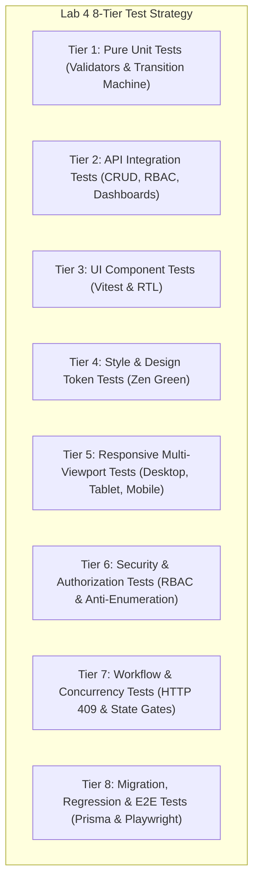

# Lab 4 Software Test Specification & Traceability Matrix

## TokTickIT — Actions Taken, Concurrency, and Dashboards

---

## 1. Test Strategy & 8-Tier Architecture

To guarantee the quality, security, and stability of the final TokTickIT software increment (Lab 4, CPE 334), this test plan implements the full **8-Tier Test Architecture** mandated by Section 10 of the course labsheet:

> **Pre-Implementation Notice:** In accordance with Spec-Driven Development (SDD) standards, all tests in this document are authored before code construction and have an initial status of **`Planned`**.

---

## 2. Comprehensive 8-Tier Test Catalog

### Tier 1: Pure Unit Tests (Domain Logic & State Machines)

| Test ID | Type | Requirement / AC | What It Tests | Expected Result | Automated Test File | Final |
| :--- | :---: | :---: | :--- | :--- | :--- | :---: |
| `UNIT-01` | Unit | BR-04, AC-04 | Action Taken validation: `followUpRequired=true` with missing or blank `followUpNote`. | Validator function throws validation error. | `server/tests/lab-04/actions-validation.unit.test.ts` | Planned |
| `UNIT-02` | Unit | BR-05, AC-01 | Action Taken validation: text boundaries for `description` and `result` (1..2000 chars). | Rejects strings with length 0 or > 2000 chars. | `server/tests/lab-04/actions-validation.unit.test.ts` | Planned |
| `UNIT-03` | Unit | BR-11, AC-10 | Ticket status transition engine: validates 8-state transition matrix. | Permits legal transitions; rejects invalid ones (e.g., `NEW -> RESOLVED`). | `server/tests/lab-04/workflow-engine.unit.test.ts` | Planned |

---

### Tier 2: API & Integration Tests (HTTP Boundaries & Database)

| Test ID | Type | Requirement / AC | What It Tests | Expected Result | Automated Test File | Final |
| :--- | :---: | :---: | :--- | :--- | :--- | :---: |
| `API-01` | API | FR-02, AC-01 | `POST /api/tickets/:id/actions` with valid payload by IT Staff. | Action created with `performedById` bound to caller session; returns HTTP 201. | `server/tests/lab-04/actions-taken.api.test.ts` | Planned |
| `API-02` | API | FR-01, AC-07 | `POST /api/tickets/:id/actions` multiple actions by different IT Staff members. | Both actions persisted under parent ticket; returns HTTP 201. | `server/tests/lab-04/actions-taken.api.test.ts` | Planned |
| `API-03` | API | FR-04, AC-06 | `PATCH /api/tickets/:id/actions/:actionId` update action description and result. | Record updated in DB; `updatedAt` refreshed; returns HTTP 200. | `server/tests/lab-04/actions-taken.api.test.ts` | Planned |
| `API-04` | API | FR-05, AC-03 | `GET /api/tickets/:id/actions` for owned ticket by Requester. | Returns chronological list of actions; returns HTTP 200. | `server/tests/lab-04/actions-taken.api.test.ts` | Planned |
| `API-05` | API | FR-10, AC-13 | `GET /api/dashboard/requester` calculates accurate open, waiting, and resolved counts. | Metric counts strictly match database state for caller; returns HTTP 200. | `server/tests/lab-04/requester-dashboard.api.test.ts` | Planned |
| `API-06` | API | FR-10, AC-15 | `GET /api/dashboard/requester` for user with zero tickets. | Returns 0 for all metrics and empty array `[]` for tickets; returns HTTP 200. | `server/tests/lab-04/requester-dashboard.api.test.ts` | Planned |
| `API-07` | API | FR-12, AC-14 | `GET /api/dashboard/staff` calculates unassigned, assigned-to-me, and status metrics. | Operational counters match authoritative DB queries; returns HTTP 200. | `server/tests/lab-04/staff-dashboard.api.test.ts` | Planned |
| `API-08` | API | FR-14, AC-21 | `GET /api/dashboard/admin` includes staff metrics plus user account statistics. | Returns staff metrics + `userStats` (`totalUsers`, `activeUsers`, `inactiveUsers`); returns HTTP 200. | `server/tests/lab-04/staff-dashboard.api.test.ts` | Planned |

---

### Tier 3: UI Component Tests (React & RTL)

| Test ID | Type | Requirement / AC | What It Tests | Expected Result | Automated Test File | Final |
| :--- | :---: | :---: | :--- | :--- | :--- | :---: |
| `UI-01` | Component | FR-02, AC-19 | `ActionsTaken` component rendering action cards with performer, date, description, and follow-up. | Renders action cards, displays performer badge, and formats date cleanly. | `client/tests/lab-04/ActionsTaken.test.tsx` | Planned |
| `UI-02` | Component | FR-05, AC-02 | `ActionsTaken` component in read-only mode for Requester. | Renders action timeline; hides `Record Action` and `Edit` buttons. | `client/tests/lab-04/ActionsTaken.test.tsx` | Planned |
| `UI-03` | Component | FR-11, AC-16 | `RequesterDashboard` component metric cards and drill-down links. | Cards render correct counts and contain hrefs with expected query params. | `client/tests/lab-04/RequesterDashboard.test.tsx` | Planned |
| `UI-04` | Component | FR-13, AC-17 | `StaffDashboard` component metric cards and urgent tickets list. | Renders unassigned, my tickets, status pills, and urgent attention table. | `client/tests/lab-04/StaffDashboard.test.tsx` | Planned |

---

### Tier 4: UI Style & Design System Tests (Zen Green)

| Test ID | Type | Requirement / AC | What It Tests | Expected Result | Automated Test File | Final |
| :--- | :---: | :---: | :--- | :--- | :--- | :---: |
| `STYLE-01` | Style | FR-15, AC-19 | Dashboard metric cards adopt Zen Green tokens (`--zg-surface`, `--zg-border`, `--zg-primary`). | Verified computed styles utilize CSS variables; zero raw hardcoded colors. | `client/tests/lab-04/ActionsTaken.test.tsx` | Planned |
| `STYLE-02` | Style | BR-04, AC-19 | Follow-up required badge adopts amber/orange token (`--zg-action-followup-bg`). | Follow-up badge displays distinct amber background and border. | `client/tests/lab-04/ActionsTaken.test.tsx` | Planned |

---

### Tier 5: Responsive Multi-Viewport Tests

| Test ID | Type | Requirement / AC | What It Tests | Expected Result | Automated Test File | Final |
| :--- | :---: | :---: | :--- | :--- | :--- | :---: |
| `RESP-01` | Responsive | FR-15, AC-19 | Desktop viewport (1280px): 4-column metric grid and 2-column ticket detail layout. | 4 cards in single row; side-by-side detail panels. | `e2e/lab-04/dashboards.spec.ts` | Planned |
| `RESP-02` | Responsive | FR-15, AC-20 | Tablet viewport (834px): 2-column metric grid and stacked ticket detail. | 2x2 metric grid; stacked action cards; no horizontal overflow. | `e2e/lab-04/dashboards.spec.ts` | Planned |
| `RESP-03` | Responsive | FR-15, AC-20 | Mobile viewport (375px): 1-column stacked metric cards and full-width action items. | Single column layout; `scrollWidth <= clientWidth`; zero horizontal scroll. | `e2e/lab-04/dashboards.spec.ts` | Planned |

---

### Tier 6: Security & Authorization Tests (RBAC & Boundaries)

| Test ID | Type | Requirement / AC | What It Tests | Expected Result | Automated Test File | Final |
| :--- | :---: | :---: | :--- | :--- | :--- | :---: |
| `AUTH-01` | Security | FR-05, AC-02 | `POST /api/tickets/:id/actions` attempted by Requester role. | Denied with HTTP 403 Forbidden (`FORBIDDEN_ROLE`). | `server/tests/lab-04/actions-taken.api.test.ts` | Planned |
| `AUTH-02` | Security | BR-07, AC-03 | `GET /api/tickets/:id/actions` for unowned ticket by Requester. | Denied with HTTP 404 Not Found (anti-enumeration defense). | `server/tests/lab-04/actions-taken.api.test.ts` | Planned |
| `AUTH-03` | Security | BR-02, AC-01 | Client attempts to supply spoofed `performedById` in request body. | Body field ignored; record bound strictly to `req.user.id`. | `server/tests/lab-04/actions-taken.api.test.ts` | Planned |
| `AUTH-04` | Security | FR-12, AC-14 | `GET /api/dashboard/staff` called by Requester role. | Denied with HTTP 403 Forbidden. | `server/tests/lab-04/staff-dashboard.api.test.ts` | Planned |

---

### Tier 7: Workflow, Concurrency & Resolution Gate Tests

| Test ID | Type | Requirement / AC | What It Tests | Expected Result | Automated Test File | Final |
| :--- | :---: | :---: | :--- | :--- | :--- | :---: |
| `FLOW-01` | Workflow | FR-07, AC-08 | Requester clicks "Problem Resolved" on active ticket. | `resolvedByRequester` set to `true`; comment logged; `currentStatus` stays `OPEN`. | `server/tests/lab-04/ticket-workflow.api.test.ts` | Planned |
| `FLOW-02` | Workflow | FR-07, AC-09 | IT Staff transitions ticket to `RESOLVED` status. | `currentStatus` transitions to `RESOLVED`; returns HTTP 200. | `server/tests/lab-04/ticket-workflow.api.test.ts` | Planned |
| `FLOW-03` | Concurrency | FR-08, AC-11 | Stale status transition submission with outdated `expectedUpdatedAt`. | Operation rejected with HTTP 409 Conflict and current ticket payload. | `server/tests/lab-04/ticket-workflow.api.test.ts` | Planned |
| `FLOW-04` | Workflow | BR-12, AC-12 | Attempting to add Action Taken or update status on `CLOSED` ticket. | Rejected with HTTP 400 Bad Request (terminal state locked). | `server/tests/lab-04/ticket-workflow.api.test.ts` | Planned |

---

### Tier 8: Migration, Regression & End-to-End Tests

| Test ID | Type | Requirement / AC | What It Tests | Expected Result | Automated Test File | Final |
| :--- | :---: | :---: | :--- | :--- | :--- | :---: |
| `MIG-01` | Migration | FR-01, AC-22 | Schema evolution migration applied over existing Lab 1-3 database. | All legacy users, tickets, attachments, notes, and comments preserved intact. | `server/tests/lab-04/regression-labs1-3.test.ts` | Planned |
| `REG-01` | Regression | FR-16, AC-22 | Full test suite execution across Labs 1, 2, and 3 regression scenarios. | 100% of previous server, client, and e2e test suites pass. | `server/tests/lab-04/regression-labs1-3.test.ts` | Planned |
| `E2E-01` | E2E | FR-02, AC-01 | Complete IT Staff Action Taken flow in browser (login, view ticket, record action, verify timeline). | Action logged, timeline refreshes, performer badge verified. | `e2e/lab-04/actions-taken-flow.spec.ts` | Planned |
| `E2E-02` | E2E | FR-07, AC-09 | Complete ticket resolution flow (Requester advisory flag -> IT Staff review & formal resolution). | Both steps complete successfully; status badge reflects `RESOLVED`. | `e2e/lab-04/ticket-resolution.spec.ts` | Planned |
| `E2E-03` | E2E | FR-11, AC-16 | End-to-end dashboard navigation and drill-down to filtered queues. | Clicking metric cards filters ticket queues accurately. | `e2e/lab-04/dashboards.spec.ts` | Planned |

---

## 3. Acceptance Criteria Traceability Matrix

| Acceptance Criterion | Planned Test ID | Test File Path | Initial Status |
| :--- | :---: | :--- | :---: |
| **AC-01** (Action Created with Bound Performer) | `API-01`, `AUTH-03`, `E2E-01` | `server/tests/lab-04/actions-taken.api.test.ts`, `e2e/lab-04/actions-taken-flow.spec.ts` | Planned |
| **AC-02** (Requester Action Creation Denied 403) | `AUTH-01`, `UI-02` | `server/tests/lab-04/actions-taken.api.test.ts`, `client/tests/lab-04/ActionsTaken.test.tsx` | Planned |
| **AC-03** (Requester Actions Query Anti-Enumeration) | `API-04`, `AUTH-02` | `server/tests/lab-04/actions-taken.api.test.ts` | Planned |
| **AC-04** (Mandatory Follow-Up Note Validation) | `UNIT-01` | `server/tests/lab-04/actions-validation.unit.test.ts` | Planned |
| **AC-05** (Optional Follow-Up When Not Required) | `UNIT-02`, `API-01` | `server/tests/lab-04/actions-validation.unit.test.ts` | Planned |
| **AC-06** (Update Action Taken Record) | `API-03` | `server/tests/lab-04/actions-taken.api.test.ts` | Planned |
| **AC-07** (Multi-Staff Collaborative Actions) | `API-02` | `server/tests/lab-04/actions-taken.api.test.ts` | Planned |
| **AC-08** (Advisory Requester Resolution) | `FLOW-01`, `E2E-02` | `server/tests/lab-04/ticket-workflow.api.test.ts`, `e2e/lab-04/ticket-resolution.spec.ts` | Planned |
| **AC-09** (Authoritative IT Staff Resolution) | `FLOW-02`, `E2E-02` | `server/tests/lab-04/ticket-workflow.api.test.ts`, `e2e/lab-04/ticket-resolution.spec.ts` | Planned |
| **AC-10** (Invalid State Transition Rejected 400) | `UNIT-03` | `server/tests/lab-04/workflow-engine.unit.test.ts` | Planned |
| **AC-11** (Optimistic Concurrency Conflict 409) | `FLOW-03` | `server/tests/lab-04/ticket-workflow.api.test.ts` | Planned |
| **AC-12** (Terminal Ticket Locked 400) | `FLOW-04` | `server/tests/lab-04/ticket-workflow.api.test.ts` | Planned |
| **AC-13** (Requester Dashboard Calculated Metrics) | `API-05` | `server/tests/lab-04/requester-dashboard.api.test.ts` | Planned |
| **AC-14** (Staff Dashboard Operational Metrics) | `API-07`, `AUTH-04` | `server/tests/lab-04/staff-dashboard.api.test.ts` | Planned |
| **AC-15** (Requester Empty Metrics & Recent Tickets) | `API-06` | `server/tests/lab-04/requester-dashboard.api.test.ts` | Planned |
| **AC-16** (Requester Dashboard Drill-Down) | `UI-03`, `E2E-03` | `client/tests/lab-04/RequesterDashboard.test.tsx`, `e2e/lab-04/dashboards.spec.ts` | Planned |
| **AC-17** (Staff Dashboard Unassigned Drill-Down) | `UI-04`, `E2E-03` | `client/tests/lab-04/StaffDashboard.test.tsx`, `e2e/lab-04/dashboards.spec.ts` | Planned |
| **AC-18** (Staff Dashboard My Active Drill-Down) | `UI-04`, `E2E-03` | `client/tests/lab-04/StaffDashboard.test.tsx`, `e2e/lab-04/dashboards.spec.ts` | Planned |
| **AC-19** (Desktop Responsive Timeline & Metrics) | `RESP-01`, `STYLE-01` | `e2e/lab-04/dashboards.spec.ts` | Planned |
| **AC-20** (Tablet & Mobile Zero Horizontal Scroll) | `RESP-02`, `RESP-03` | `e2e/lab-04/dashboards.spec.ts` | Planned |
| **AC-21** (Admin Augmented Dashboard with Users) | `API-08` | `server/tests/lab-04/staff-dashboard.api.test.ts` | Planned |
| **AC-22** (Full Labs 1-3 Regression Passing) | `MIG-01`, `REG-01` | `server/tests/lab-04/regression-labs1-3.test.ts` | Planned |
